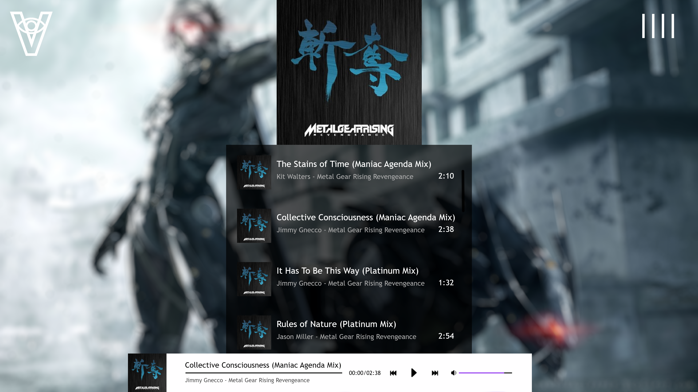
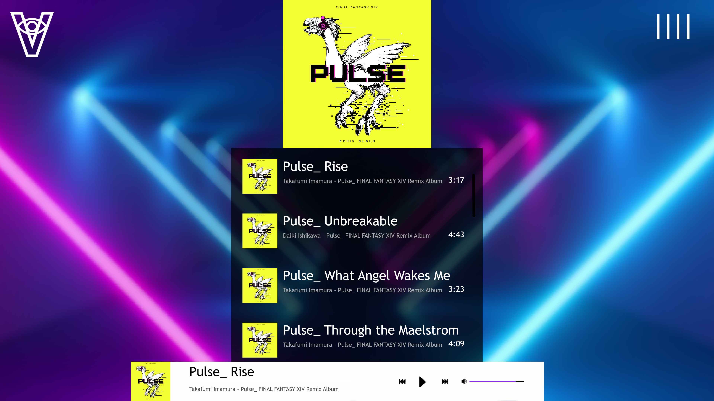
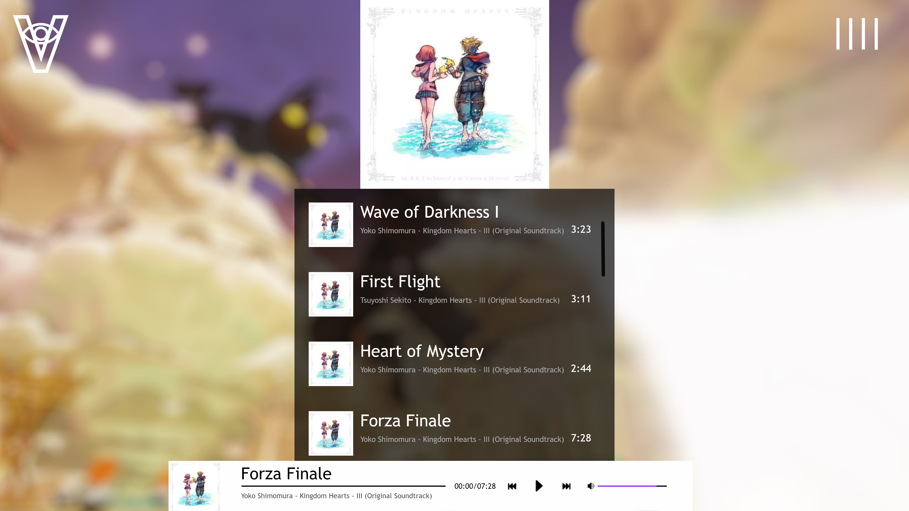
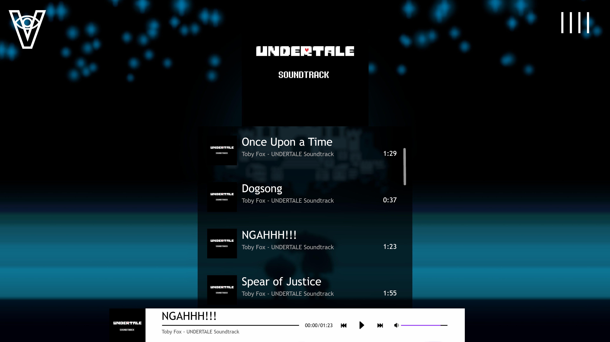
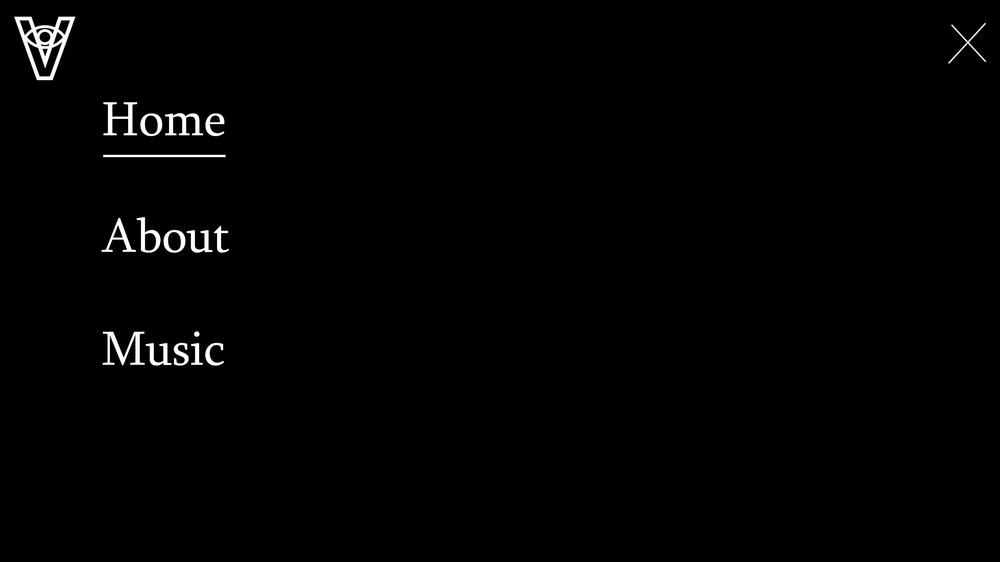

# Project_Mp3Player_UI
Project of a working MP3 player that will be implement on a website by using REACT. This Repository is mostly a rough draft about the UI for the website. This website will let you choose a selection of albums from renowned video games. This is a fan project to show a passion for music from the video game industry. 

## Front UI of the project
These pictures represent the webpage that will show the working MP3 while music is playing on the background. You can use the slider on the side to select a specific song you would like to play.

## Custom NavBar
This is a custom navbar that will let choose a selection of songs when ever you are with ease. When hovering on "MUSIC", a selection of albums will show.

